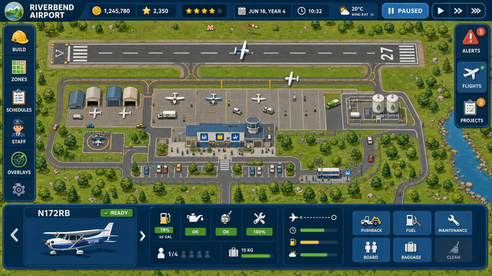
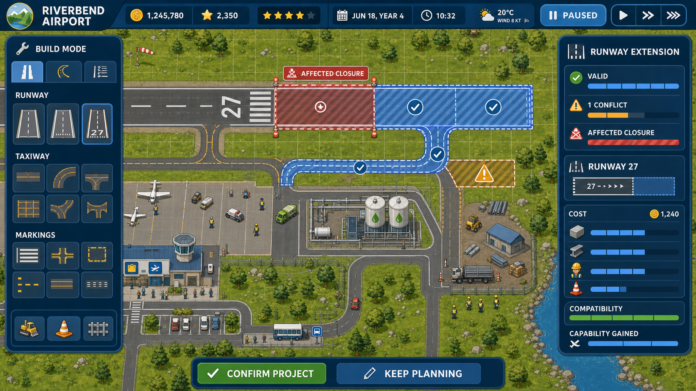
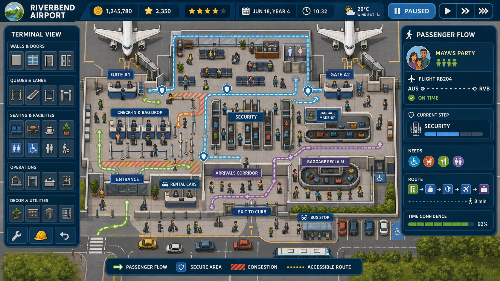
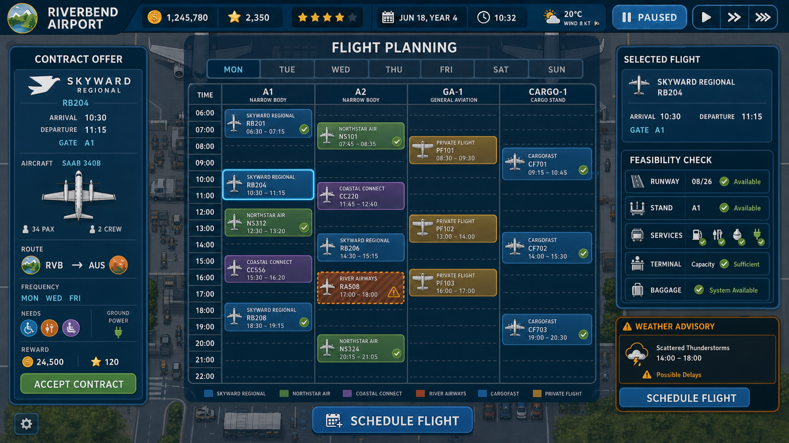
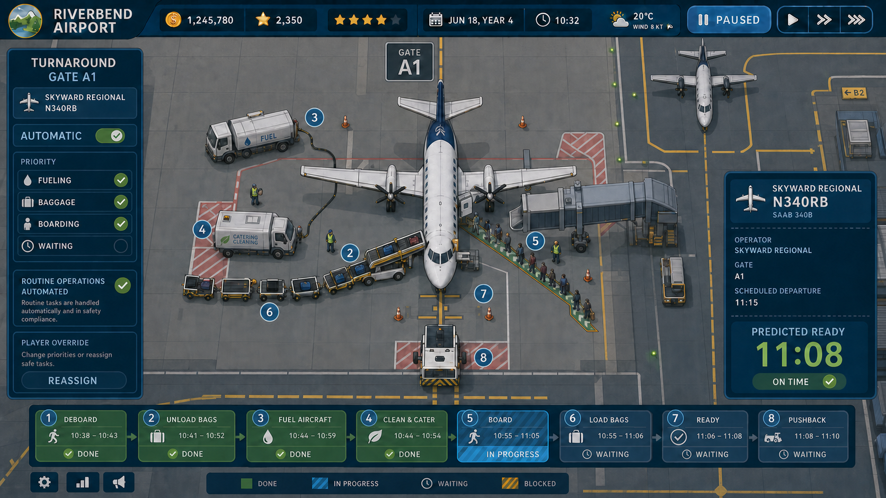
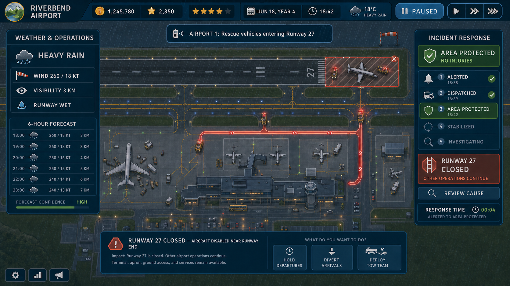
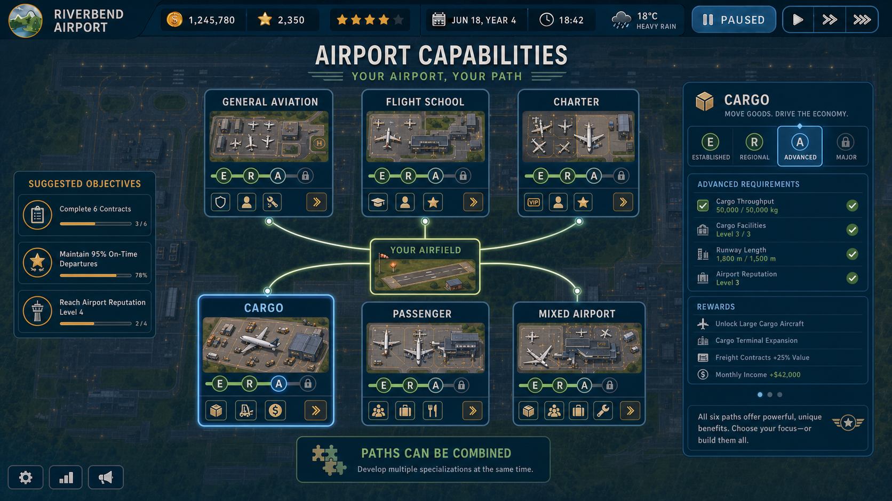

# Concept Art Reference Set

**Status:** Approved visual reference  
**Owner:** Product and visual design  
**Generated:** 2026-07-25  
**Generator:** Built-in OpenAI image generation  
**Format:** Seven PNG images, 1672 x 941

## Purpose and authority

These images are deliberate implementation references for composition, information hierarchy, gameplay readability, tone, and the relationship between the 2D airport world and its management interface. They are not shippable assets, pixel-perfect UI specifications, or permission to introduce 3D content.

[CT-05 Visual Content Requirements](../visual-content-requirements.md)
translates their required visible structures into stable, testable requirement
IDs. CT-05 is normative for content presence; this README remains the visual
interpretation and provenance record.

Authority order is:

1. approved written specifications;
2. accepted implementation behavior and accessibility tests;
3. this concept-art reference set;
4. incidental details inside generated imagery.

When an image contradicts a specification, the specification wins and the discrepancy should be recorded during visual review. Do not copy generated prices, timings, capacities, aircraft dimensions, airport geometry, operator names, route codes, or fine text without checking the owning specification and content data.

All references depict a strict top-down gameplay intention. Some generated shading gives individual objects additional volume; that is illustrative rendering, not approval for 3D meshes, perspective cameras, or 3D-dependent lighting.

## Shared visual language

Preserve these qualities across implementation:

- a readable orthographic 2D airport remains the primary surface;
- deep navy management chrome frames the world without obscuring it;
- warm concrete, grass green, off-white text, cyan selection, amber caution, and restrained coral critical status form the baseline palette;
- large rounded panels use strong grouping and generous spacing;
- authentic airport objects and terms are paired with approachable icons;
- state always uses icon, shape, pattern, or text in addition to color;
- world overlays appear on the airport itself and connect visibly to their explanation panels;
- routine operations feel calm, animated, and watchable;
- warnings explain affected area, cause, consequence, and available response;
- aircraft and operators remain fictional in appearance unless separately approved.

Do not treat the images as a mandate for their exact top bar, logo, currency totals, star count, fonts, shadows, panel dimensions, or number of simultaneous controls.

## Reference catalog

### VA-01: Airport overview and HUD

**Use for:** overall game identity, HUD regions, overview density, orthographic airport readability, persistent time/weather/status, selection context.

**Validate:** the airport remains dominant; core status is glanceable; left tools, right activity, and bottom context have distinct jobs; GA, passenger, service, and landside activity coexist visibly.

**Do not copy literally:** the depicted airport geometry, currency values, aircraft type art, or exact button inventory.

### VA-02: Build mode and runway extension

**Use for:** proposal mode, live placement feedback, construction catalog, pattern-backed validation, work-zone preview, affected-only closure, cost/material summary.

**Validate:** proposed versus operational geometry is unmistakable; conflicts are spatially located; the closure is smaller than the airport; confirmation follows understanding.

**Do not copy literally:** the shown price, project dimensions, or combination of valid and conflict summaries. PX-04 and GS-01 control validation semantics.

### VA-03: Terminal and passenger flow

**Use for:** complete terminal cutaway, process adjacency, named party inspection, passenger-flow overlays, secure boundaries, baggage visibility, landside connection.

**Validate:** departure and arrival paths are legible; security cannot be bypassed; baggage is spatially connected; accessible routing is visible; compact passenger needs do not overwhelm the panel.

**Do not copy literally:** room dimensions, passenger counts, route code, or checkpoint equipment.

### VA-04: Flight planning and timetable

**Use for:** contract-to-schedule workflow, exact slot and gate ownership, feasibility feedback, fictional operator identity, high-risk warnings.

**Validate:** timetable is the dominant planning tool; flight cards reveal aircraft and operator at a glance; conflicts are patterned and localized; runway, stand, services, terminal, baggage, and weather evidence are adjacent to the decision.

**Do not copy literally:** schedule density, times, rewards, aircraft model, route codes, or column count.

### VA-05: Aircraft turnaround

**Use for:** close operations zoom, visible service choreography, automatic task dispatch, dependency timeline, service safety zones, predicted readiness.

**Validate:** the aircraft remains the visual anchor; vehicles have safe positions; concurrent and waiting work are distinct; the player controls priorities and overrides rather than manually driving.

**Do not copy literally:** vehicle placement, task duration, service compatibility, aircraft geometry, or the amount of dimensional shading.

### VA-06: Weather and incident response

**Use for:** meaningful forecast, readable poor-weather operation, captioned radio, incident lifecycle, emergency route, abstract harm reporting, recoverable affected-only closure.

**Validate:** wind/visibility/surface condition connect to operations; the warning remains readable over weather; no human harm is depicted; closure scope and continuing operations are explicit; response progress and cause review are visible.

**Do not copy literally:** forecast values, response time, incident probability, or exact runway layout.

### VA-07: Progression and specializations

**Use for:** guided sandbox, optional objectives, capability bands, equal endgame prominence, multi-specialization freedom.

**Validate:** GA, flight school, charter, cargo, passenger, and mixed paths have equal visual weight; no path funnels into passenger; exactly three suggested objectives are shown; Major is a capability band rather than an ending.

**Do not copy literally:** unlock requirements, throughput, rewards, levels, or exact node layout.

## Generation briefs

The shared prompt requested a premium flat 2D cartoon airport-management interface for aviation-aware children aged 5–10, with strict top-down orthographic gameplay, fictional operators, readable icon-plus-text status, navy interface chrome, and no real branding, military aircraft, photorealism, or 3D presentation.

Each image then focused on one implementation surface:

1. complete airport overview and HUD;
2. runway/taxiway construction proposal with localized conflict and closure;
3. terminal cutaway with passenger, security, baggage, and access flows;
4. contract offer, exact timetable slots, gates, and feasibility;
5. automated turnaround task dependencies and service vehicles;
6. forecast weather and age-appropriate incident response;
7. non-exclusive progression across all six airport specializations.

VA-05 was regenerated after review because its first version described player override as taking control of vehicles, contradicting automated service dispatch. The approved version limits the interaction to priorities and safe reassignment.

VA-06 was regenerated after review because its first version offered reciprocal Runway 09 while the physical Runway 27 was closed. The approved version instead offers hold, divert, and tow responses. These corrections demonstrate that generated art must be operationally reviewed before it becomes implementation evidence.

## Validation workflow

At the UI/presentation gate for each roadmap phase:

1. open the owning written specifications;
2. open the mapped concept image at full size;
3. capture the implemented surface at the equivalent zoom and state;
4. compare information hierarchy, world/UI balance, overlays, status redundancy, tone, and required actions;
5. record intentional differences and specification-driven corrections;
6. run accessibility and behavioral acceptance tests;
7. never approve behavior solely because it resembles the image.
